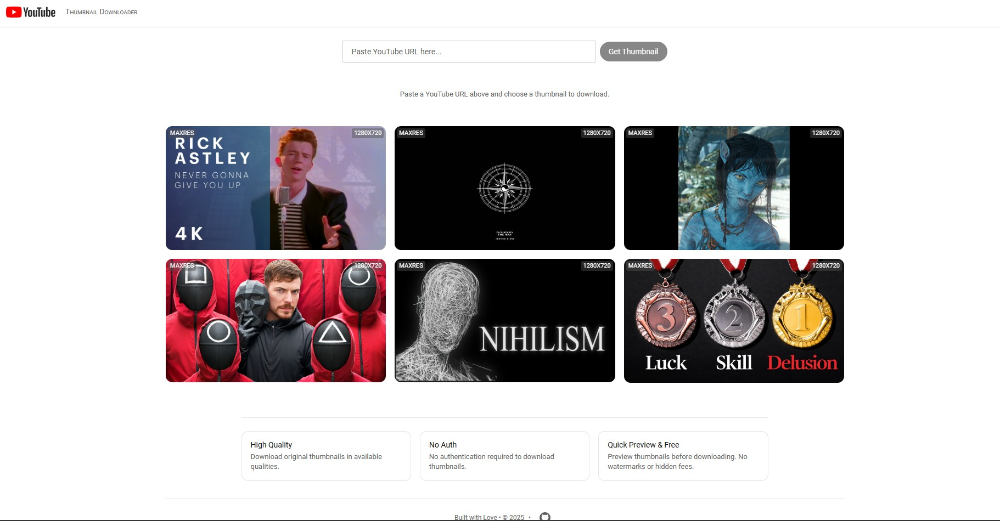
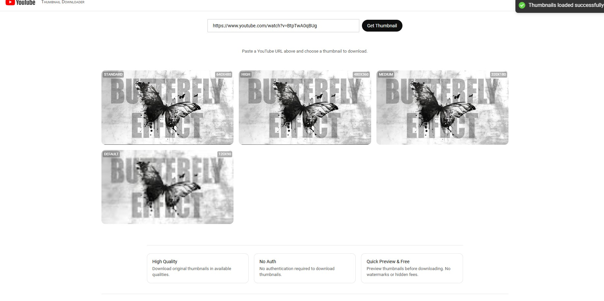

# YT-Thumbnailer 

A modern, fast, and elegant YouTube thumbnail downloader built with React and TypeScript. Download high-quality thumbnails from any YouTube video with just a paste.



## ✨ Features

- 🖼️ Download thumbnails in all available qualities
- 🚀 Client-side only - no backend required
- 👁️ Preview thumbnails before downloading
- 💨 Fast and responsive UI
- 🎨 YouTube-inspired design
- 📱 Mobile-friendly layout

## 🚀 Demo

Try it live: [YT-Thumbnailer Demo](https://thumbnaildownload.vercel.app)



## 🛠️ Tech Stack

- React
- TypeScript
- Vite
- CSS3 with modern animations
- React Hot Toast for notifications

## 💻 Local Development

1. Clone the repository
```bash
git clone https://github.com/kushal1o1/YT-thumbnailer.git
cd YT-thumbnailer
```

2. Install dependencies
```bash
npm install
```

3. Start the development server
```bash
npm run dev
```

4. Build for production
```bash
npm run build
```

## 🌟 Usage

1. Copy any YouTube video URL
2. Paste it into the input field
3. Choose your preferred thumbnail quality
4. Click download and enjoy!


## 🤝 Contributing

Contributions, issues, and feature requests are welcome! Please read the contribution guide and project standards before opening a pull request.

- Contribution guide: [CONTRIBUTION.md](CONTRIBUTION.md)
- Coding standards: [STANDARDS.md](STANDARDS.md)
- License: [LICENSE](LICENSE)

To contribute: fork the repo, create a feature branch (e.g. `feat/add-default-thumbnails`), follow the commit message prefixes (`feat:`, `fix:`, `refactor:`, `UI:`, etc.), and open a PR targeting `main`.

See `CONTRIBUTION.md` for full details on branch naming, commit message conventions, PR checklist and testing expectations.

---

Built with ❤️ by [kushal1o1](https://github.com/kushal1o1) • © 2025
